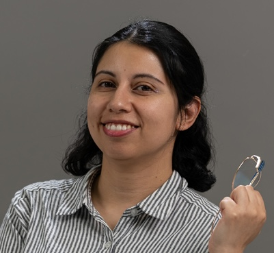

## Principal Investigator

::: {.person-card}
```{=html}

```
::: {.person-info}
### Sara Acevedo
**Assistant Professor** · Facultad de Agronomía y Sistemas Naturales  
Pontificia Universidad Católica de Chile

Researcher at [CEDEUS](https://cedeus.cl). Working on the physical properties of urban soils, water retention, and the hydrological behaviour of the urban ecosystem.

[ORCID](https://orcid.org/0000-0003-3203-2106) &nbsp;
[GitHub](https://github.com/Urban-Soil-Biophysics)
:::
:::

---

## Researchers 
::: {.people-grid}

::: {.person-card-sm}
### Mariana Dos Santos Moreno
**PhD Student**  
Topic: Urban Soil C dynamics
[ORCID](https://orcid.org/0000-0001-6001-8219) &nbsp;
[GitHub](https://github.com/runaweay)
:::

::: {.person-card-sm}
### Agustín Coddou
**Research Assistant (2025)**  
Topic: Urban Temperature 
[Linkedin](https://www.linkedin.com/in/agustin-coddou/) &nbsp;
[GitHub](https://github.com/acoddou)
:::

:::

---

## Collaborators

| Name | Institution | Area |
|------|-------------|------|
| [Alejandra Vega](https://www.cedeus.cl/sobre-nosotros/investigadores/ia-alejandra-vega/) | CEDEUS | Urban Soil Geochemist |
| [Moreen Willaredt](https://urbansciencelab.ucdavis.edu/people-0) | UC-Davis Urban Science Lab | Urban Ecosystem Scientist |

---


::: {.callout-note appearance="minimal"}
Interested in collaboration? [Contact Us](mailto:seaceved@uc.cl)
:::
